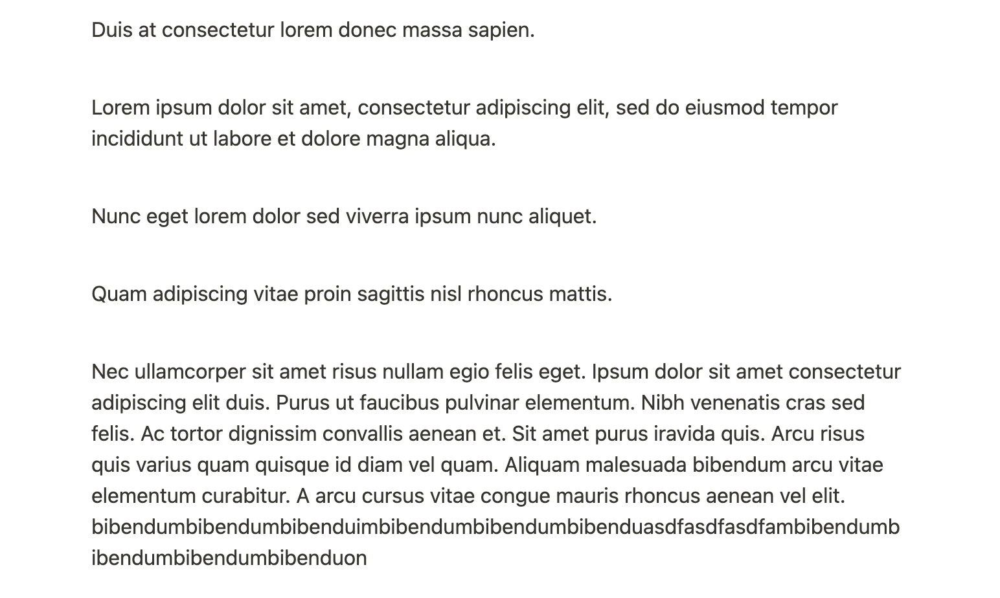
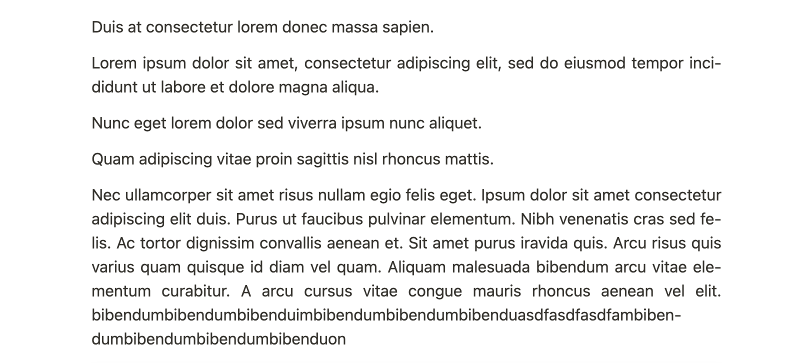

# Obsidian Secret Sauce Box

A plug-in with all my nice little JavaScript secret sauce snippets, with some flexibility from the settings page.

# List of Secret Sauces

## Double Click Maximize Active

Double clicking a tab header in a pane with:
- **Tabs stacked**: maximize the current sliding tab.

- **Tabs unstacked**: maximize the current pane (same behavior as double clicking tab headers in VSCode).

## Preserve Active Tab

When setting a pane from "Unstack tabs" to "Stack tabs", the active tab is focused but not selected (expanded) as expected. Enabling this secret sauce to fix the behavior.

**Before**: the active (third) tab is not expanded.

**After**

## Set Doc Global Lang Attribute

Sometimes it would be helpful to set the `lang` attribute of your document to enable some language specific stylings. For example, setting `lang` to languages that uses hyphen allows you to break long words with a hyphen when encountering a line break. This can improve readability under the preview mode.

This secret sauce allows you to set the `lang` attribute with a valid langauge subtag, and provides an option to enable/disable the hyphen line break style. Remember that to let the hyphen style take effects, the `lang` attribute must be set to a language that uses hyphen (e.g. `en`)!

**Source**

**Preview**: with hyphen break enabled

